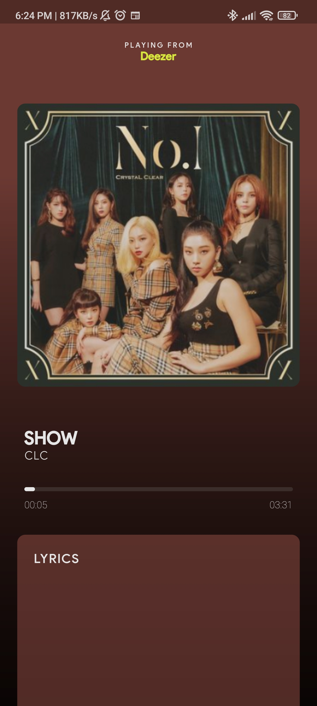

# LightSync
Flutter application that changes the colour of your connected WS2812B LED strip based on the dominant colours in your Spotify album art [WORK IN PROGRESS]

Version 1 (NowPlaying package test)

{:class="img-responsive"}

Version 2 (Dominant color identification & HTTP requests test)

